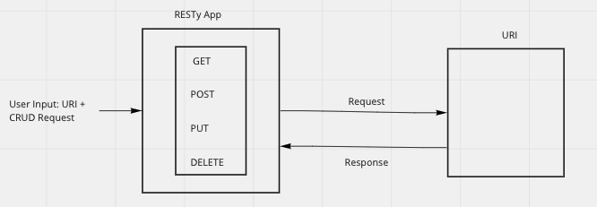

# RESTy

A React App that allows users to query a URL with CRUD methods.

## Installation

- git clone git@github.com:SpencerTower/resty.git

## Using the app

- npm start
- Enter URL in URL field
- Select CRUD method
- Select 'Go'
- API results will be displayedgs

## UML

